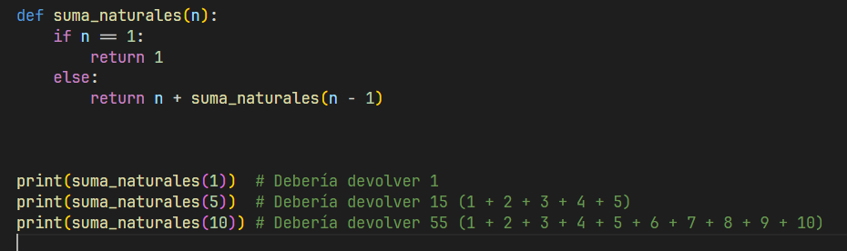
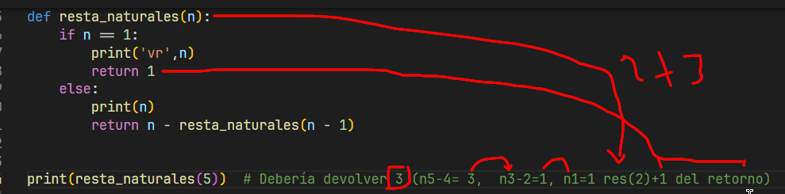
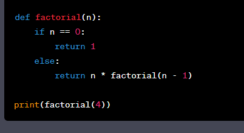
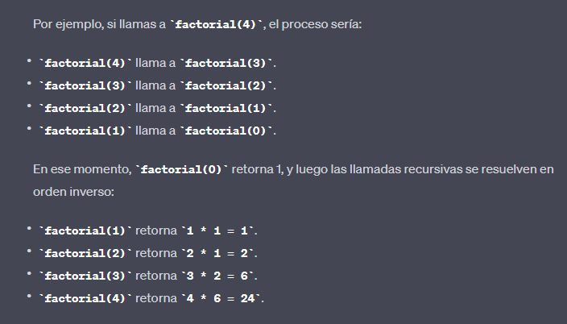

# Funciones Recursivas

Las funciones recursivas son un concepto fundamental en la programación y las matemáticas. Se refieren a la capacidad de una función para llamarse a sí misma dentro de su propia definición.

* <b> Definición recursiva:</b> Una función recursiva se define en términos de sí misma. Esto significa que en el cuerpo de la función, hay una llamada a la misma función. Por lo general, una función recursiva tiene uno o más casos base que indican cuándo debe detenerse la recursión.

* <b> Casos base:</b> Los casos base son las condiciones en las que la función recursiva debe detenerse y no llamarse a sí misma nuevamente. Son esenciales para evitar que la recursión se convierta en un bucle infinito. Los casos base son típicamente simples y directos de resolver.

* División en subproblemas: En una función recursiva, se divide el problema original en subproblemas más pequeños y similares. Cada vez que la función se llama a sí misma, lo hace con un subproblema más pequeño o con datos diferentes pero del mismo tipo.

* Pila de llamadas: Cada vez que se llama a una función recursiva, se crea un nuevo contexto de ejecución en la pila de llamadas. 

* Esto significa que cada llamada a la función se almacena en la pila hasta que se llega a un caso base, momento en el que se empiezan a resolver las llamadas en orden inverso, utilizando los resultados para calcular el resultado final.

 
€ ejemplo 1 

* Suma:

 

 

* Resta:

 

* Miltiplicacion  #  1! = 1, 2! = 2, 3! = 6

### Explicacion del ejemplo

1) <b>n</b>  es el número para el cual deseas calcular el factorial. En cada llamada recursiva, este valor disminuye en 1.

2) <b>factorial(n - 1)</b> es la llamada recursiva a la misma función factorial pero con un valor reducido de<b> n en 1 unidad.</b> Esto es lo que hace que la función sea recursiva, ya que se llama a sí misma.

2) <b>n * factorial(n - 1) </b>multiplica el valor actual de n por el resultado de la llamada recursiva factorial(n - 1). Esto es lo que realiza el cálculo del factorial.

El proceso se repite en cada llamada recursiva, reduciendo el valor de n en 1 en cada paso hasta que se alcance el caso base, que en este caso es cuando n es igual a 0. En ese punto, la función devuelve 1, lo que detiene la recursión.
 
<b>
Luego, cuando las llamadas recursivas comienzan a resolverse en orden inverso (desde el caso base), los valores acumulados se multiplican para obtener el resultado final del factorial.
</b>

 

#### Retos pendiente:

1. Eliminar caracteres: Crea una función recursiva que elimine todas las ocurrencias de un carácter específico en una cadena. Por ejemplo, eliminar todas las letras 'o' en "otorrinolaringología".

2. Palíndromos: Desarrolla una función recursiva que determine si una cadena es un palíndromo, es decir, si se lee igual de izquierda a derecha que de derecha a izquierda. Ejemplo de palíndromo: "anilina".

3. Concatenar n veces: Escribe una función recursiva que tome una cadena y un número n, y devuelva una nueva cadena que sea la concatenación de la cadena original n veces. Por ejemplo, si la entrada es ("abc", 3), la función debería devolver "abcabcabc".

4. Contar palabras: Crea una función recursiva que cuente cuántas palabras hay en una cadena. Puedes asumir que las palabras están separadas por espacios en blanco. Por ejemplo, en la cadena "Hola mundo", hay dos palabras.

5. Eliminar espacios en blanco: Desarrolla una función recursiva que elimine todos los espacios en blanco de una cadena. Por ejemplo, "Hola mundo" se convertiría en "Holamundo".

6. Comprobar subcadena: Escribe una función recursiva que determine si una cadena contiene una subcadena específica. Por ejemplo, si la cadena es "abcdefg" y la subcadena es "cde", la función debería devolver True.

7. Generar todas las permutaciones: Crea una función recursiva que genere todas las permutaciones de una cadena. Por ejemplo, si la entrada es "abc", la función debería devolver una lista con todas las posibles permutaciones: ["abc", "acb", "bac", "bca", "cab", "cba"].